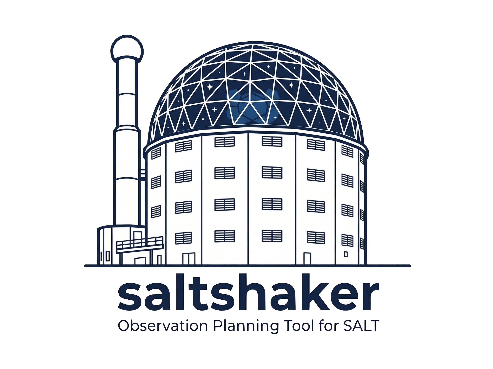

# SALTishaker

<p align="center">
  
</p>

**SALTishaker** is a specialized Python package designed for planning astronomical observations with the **Southern African Large Telescope (SALT)**.

Because SALT operates with a unique fixed-altitude design (pointing permanently at 37 degrees from the zenith), planning observations requires calculating complex visibility tracks based on Earth's rotation and a physical payload tracker. `saltishaker` handles these calculations for you, providing high-performance visibility windows, track lengths, and integration with the broader `astroplan` ecosystem.

## Key Features

*   **Visibility Windows:** Calculate exactly when (UTC) a specific star or galaxy will drift into SALT's field of view.
*   **Track Lengths:** Determine how long SALT can track a target before it hits the edge of its operational limits.
*   **Astroplan Integration:** Use SALT-specific tracking and lunar constraints directly within `astroplan` scheduling.
*   **Semester Planning:** Automatically calculate visibility statistics and nights for entire 6-month SALT observing semesters.
*   **Singleton Tracking Model:** Efficient data loading and high-performance interpolation.

## Installation

```bash
pip install saltishaker
```

For development installation:

```bash
git clone https://github.com/enzo-peres-afonso/saltishaker.git
cd saltishaker
pip install .
```

## Quick Start

```python
from saltshaker import get_salt_observer
from astropy.coordinates import SkyCoord
from astropy.time import Time

# Initialize the observer
observer = get_salt_observer()

# Define a target
target = SkyCoord.from_name("Sirius")
time = Time("2026-01-15 12:00:00")

# Get visibility tracks
tracks = observer.get_tracks(target, time)

for track in tracks:
    print(f"Visible from {track.start_time_utc} to {track.end_time_utc}")
```

## Documentation

Full documentation, including a theoretical background on SALT visibility and a "Proposer's Cookbook" of examples, is available at:

**[https://saltishaker.readthedocs.io/](https://saltishaker.readthedocs.io/)**

## License

This project is licensed under the MIT License - see the LICENSE file for details.
